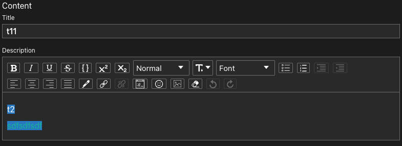

# CMS

> ⚠️ WIP: still under heavy development. This is currently only a proof of concept.

Generate a full CMS from a simple schema.

### Getting Started

Define and export a schema inside `config/schemas.ts`:

```javascript
import { createSchema, fields } from "../client/src/cms";

export const homePage = createSchema({
  title: fields.text(),
  description: fields.richText(),
});
```

Visit `/content/homePage` on the client and populate the fields with some data:



Visit `/api/content/homePage` on the server and you will see the populated schema in JSON format:

```json
{
  "title": {
    "type": "text",
    "value": "t11"
  },
  "description": {
    "type": "richText",
    "value": "<p>...</p>"
  }
}
```

### Fields

| Field    | Description                |
| -------- | -------------------------- |
| text     | Basic text input           |
| richText | WYSIWYG editor             |
| color    | HEX/RGBA color picker      |
| datetime | Date and time picker       |
| list     | Repeatable array of fields |
| group    | Group object of fields     |

### Contributing

Set up `ENV_VARS`:

```shell
cp client/.env.example client/.env
cp server/.env.example server/.env
```

Start in development mode:

```shell
npm install
npm start
```
